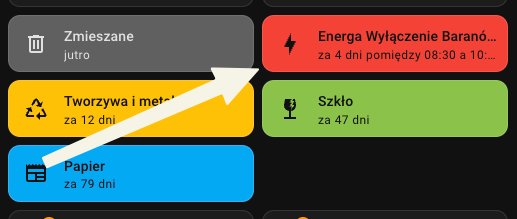

# Energa Awarie (Home Assistant)

Integracja Home Assistant, która monitoruje planowane wyłączenia prądu od Energa Operator i tworzy sensor pokazujący ile dni zostało do następnego planowanego wyłączenia dla wybranej lokalizacji (powiat + gmina + opcjonalnie miasto / ulica).

## Instalacja

### HACS (zalecane)
1. Dodaj to repozytorium do HACS jako niestandardowe repozytorium (typ: Integration).
2. Zainstaluj "Energa Awarie".
3. Uruchom ponownie Home Assistant.

### Ręczna
1. Skopiuj `custom_components/energa_awarie` do katalogu `config/custom_components/` w Home Assistant.
2. Uruchom ponownie Home Assistant.

## Konfiguracja
1. Ustawienia → Urządzenia i usługi → Dodaj integrację.
2. Wyszukaj "Energa Awarie".
3. W formularzu podaj:
   - Powiat (lista identyfikatorów)
   - Gmina (wymagane)
   - Miasto (opcjonalnie – zawęża dopasowanie)
   - Ulica (opcjonalnie – dalsze zawężenie po tekście)
   - Kalendarz (opcjonalnie – wybierz istniejący `calendar.*` aby automatycznie tworzyć wydarzenia)

Po zapisaniu utworzony zostanie jeden sensor. Unikalność konfiguracji bazuje na kombinacji: powiat + gmina + (opcjonalnie) miasto + ulica.

## Sensor
- Stan: liczba dni (zaokrąglone w górę) do najbliższego przyszłego planowanego wyłączenia.
- Atrybuty:
  - start: ISO start najbliższego wyłączenia
  - end: ISO koniec najbliższego wyłączenia
  - description: opis + lokalizacja (źródłowy tekst Energa)
  - awarie: liczba dopasowanych wyłączeń
  - county, area (gmina), city, street: użyte filtry
  - attribution: źródło danych

Gdy brak przyszłych wyłączeń – stan = nieustawiony (None), atrybuty start/end puste.

## Opcjonalne wydarzenia kalendarza
Jeśli wybierzesz encję kalendarza:
- Dla każdego przyszłego planowanego wyłączenia integracja spróbuje dodać wydarzenie.
- Nazwa wydarzenia = nazwa sensora.
- Opis wydarzenia = opis awarii zwracany przez Energa.
- Duplikaty są pomijane (proste sprawdzanie istniejących zdarzeń danego dnia).
- Wydarzenia obejmują dokładny czas rozpoczęcia i zakończenia (lokalna strefa czasowa).

Aby wyłączyć tworzenie wydarzeń: edytuj wpis integracji i usuń wskazany kalendarz (lub skonfiguruj nowy wpis bez kalendarza).

Wydarzenia kalendarza można wyświetlić za pomocą karty [custom:trash-card](https://github.com/idaho/hassio-trash-card)

## Uwagi
- Źródło danych: https://energa-operator.pl/uslugi/awarie-i-wylaczenia/wylaczenia-planowane
- Logika pobierania i parsowania JSON znajduje się w `custom_components/energa_awarie/outages.py`.
- Interwał odpytywania: 12 godzin.
- Zmiana struktury strony może wymagać dostosowania metod: `_download_json`, `_parse_json_outages` lub `_extract` w pliku `outages.py`.

## Licencja
MIT
